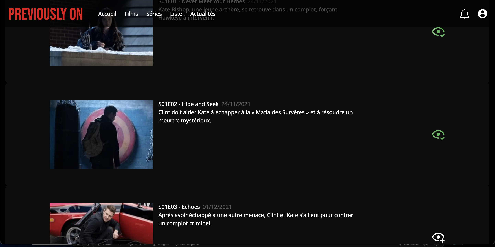
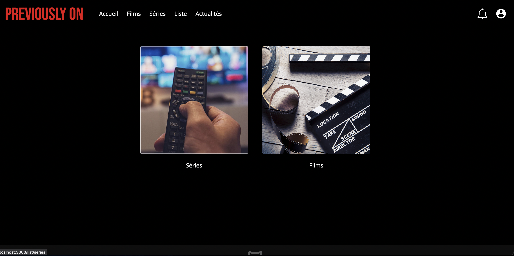
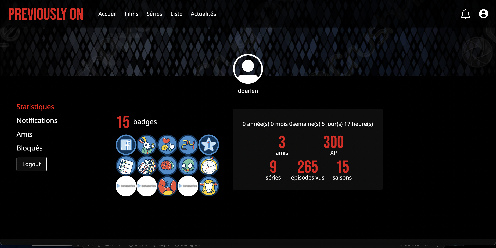
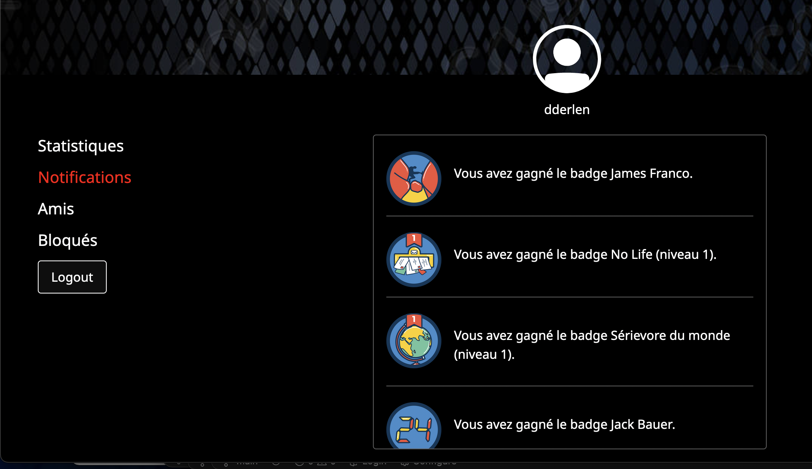

<h1 align="center">Previously On</h1>

<h2>Présentation du projet</h2>

Vous ne savez plus où vous en êtes entre Vikings, Community, One Piece et Plus belle la vie ? Il vous faut donc un très bon outil pour gérer tout ça et ne plus vous retrouver à rematter 15 fois la mort de SPOILER ALERT dans Game of Thrones parce que vous avez peur de sauter un épisode. Voici Previously On, une application développée en React JS, Node JS, avec la très complète API BetaSeries: http://www.betaseries.com/api/docs

Ceci est un projet réalisé en duo avec mon super binôme <a href="https://github.com/CorentinNrd">Corentin Nrd ⭐️</a>

NB: ce projet est entièrement responsive (pc, tablette, smartphone)

<h2>Installation du projet</h2>

BetaSeries étant une API privée <i><strong>il est impératif de déjà posséder un compte sur ce site ou de s'y inscrire au préalable</strong></i>, aussi la connexion à notre app ne comprend pas la prise en charge de réseaux sociaux alors inscrivez vous à l'aide d'une adresse mail et choisissez un mot de passe <a href="https://www.betaseries.com/inscription/compte">ici</a> (oui c'est long et ancien mais c'est important 😄)

Côté code, clônez le répertoire suivant. Une fois clôné, dirigez vous dans votre terminal sur le dossier "serveur", entrez <code>npm install</code> une fois l'installation faite, allez dans "client" et refaites <code>npm install</code>. Vous avez installé tous les packages nécéssaires au bon fonctionnement de l'app! Il reste une dernière étape: le <code>.env</code>

<h3>Étape 1</h3>

 Vous êtes normalement toujours dans client, ouvrez un nouveau fichier, lequel s'appellera .env; à l'intérieur écrivez ces deux lignes:
  <ul>
    <li>REACT_APP_CLIENT_ID="votre_client_id"</li>
    <li>REACT_APP_REDIRECT_URI="http://localhost:8000"</li>
  </ul>
  
Pour obtenir une clé développeur il suffit de remplir le formulaire à cette adresse -> https://www.betaseries.com/api/

 <h3>Étape 2</h3>
 Dirigez vous dans le dossier serveur et créer un autre .env, ajoutez ces lignes:
 <ul>
  <li>CLIENT_ID="votre_client_id"</li>
  <li>CLIENT_SECRET="votre_clef_client_secrete"</li>
  <li>REDIRECT_URI="http://localhost:8000"</li>
 </ul>

Les deux premières lignes sont trouvables en suivant les étapes de demande de clé développeur à l'adresse mentionnée à l'étape 1

Vous voilà prêt à lancer l'app

NB: elle est dockerisée si besoin, si vous ne savez pas utiliser docker ce n'est pas très grave, ouvrez deux terminals -> un sur server entrez <code >nodemon server.js</code> un sur client entrez <code>npm start</code>, une page internet devrait s'ouvrir sur votre navigateur favori (Mozilla Firefox bien sûr!)

<h2>Utilisation de l'app</h2>

Nous nous sommes inspiré du fameux site de streaming rouge et noir -Tuduuuum- pour l'esthétique de notre projet. Notre but étant de s'en approcher au maximum, nous nous sommes aussi inspirés de l'application "Tv Time" qui permet de suivre les films et les séries vues (https://www.tvtime.com/) pour le display des épisodes.

Voici quelques images du projet en attendant qu'on le déploie; respectivement la page d'accueil, fiche détaillée d'une série ainsi que le suivi des épisodes, les originales sont disponibles dans le repertoire pour plus de détails. 

Chaque film ou série se présente sous la forme d'une fiche détaillée, pour l'un comme pour l'autre il y a la possibilité de marquer un vu, qui ajoute à la liste de visionnage et pour les épisodes un liste avec une icône "oeil vert" ou "oeil blanc" pour les épisodes vus ou nons vus, pour s'y retrouver dans toutes ces séries!

 

  
  
  

 

Comment ça fonctionne? Dans la barre de navigation vous avez 5 menus à votre disposition (hormis profil et notifications) pour naviguez et retrouver vos programmes préférés. En cliquant sur "films" ou "séries" vous aurez accès à une page de recherche

  

 

En cliquant sur "liste" vous aurez accès à tous le films ou séries que vous avez marqué(e)s comme vu(e)s, favoris ou archivé(e)s

  
  
 

 

Et pleins d'autres features à découvrir au fil du scroll!

 

Previously On est aussi une app sociale ! Vous pouvez à partir de votre profil rechercher des membres, les ajouter en tant qu'amis, les bloquer, les supprimer, visualiser leurs profils, leur statistiques, leurs films ou séries favorites etc... Plus vous marquerez de séries ou films ou de séries en vus plus vous dévérouillerez de badges, plus vos statistiques augmenteront

Tous ce qui concerne la modification d'informations (changement de mdp, de photo de profil, de bannière etc) se fera directement sur votre profil BetaSeries car ce ne sont pas des fonctionnalités qui sont en cours d'implémentation

  
  

